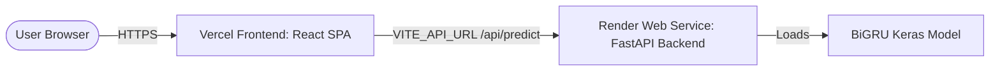

# DeepMood Deployment Guide: Render (Backend) + Vercel (Frontend)

This guide walks you through deploying **DeepMood** in production:
- **Backend (FastAPI + BiGRU Keras model)** on **Render**
- **Frontend (React + Vite SPA)** on **Vercel**

---

## Architecture Overview



---

## Part 1: Deploy Backend to Render

### Option A: 1-Click Render Blueprint (Recommended)

DeepMood includes a pre-configured [`render.yaml`](file:///Users/nur/code/ml/projects/deep-mood/render.yaml) file:

1. Push your code to your GitHub repository:
   ```bash
   git add .
   git commit -m "Configure production deployment for Render and Vercel"
   git push origin main
   ```
2. Log into [Render Dashboard](https://dashboard.render.com).
3. Click **New +** → **Blueprint**.
4. Connect your **deep-mood** repository.
5. Render will automatically detect [`render.yaml`](file:///Users/nur/code/ml/projects/deep-mood/render.yaml) and configure:
   - **Service Name**: `deepmood-api`
   - **Runtime**: Python 3.11.9
   - **Build Command**: `pip install --upgrade pip && pip install -r backend/requirements.txt`
   - **Start Command**: `uvicorn backend.app.main:app --host 0.0.0.0 --port $PORT`
6. Click **Apply**.
7. Once deployed, copy your Render service URL (e.g., `https://deepmood-api.onrender.com`).

---

### Option B: Manual Web Service Setup on Render

If you prefer setting it up manually in the Render dashboard:

1. In Render Dashboard, click **New +** → **Web Service**.
2. Select your **deep-mood** GitHub repository.
3. Configure the following fields:
   - **Name**: `deepmood-api` (or your choice)
   - **Region**: Choose closest to you (e.g., Frankfurt, Oregon, Ohio, Singapore)
   - **Branch**: `main`
   - **Root Directory**: `.` (leave blank or set to repository root)
   - **Runtime**: `Python 3`
   - **Build Command**:
     ```bash
     pip install --upgrade pip && pip install -r backend/requirements.txt
     ```
   - **Start Command**:
     ```bash
     uvicorn backend.app.main:app --host 0.0.0.0 --port $PORT
     ```
   - **Instance Type**: `Free`
4. Under **Environment Variables**, add:
   | Key | Value | Description |
   |---|---|---|
   | `PYTHON_VERSION` | `3.11.9` | Ensures compatible Python build for TensorFlow wheels |
   | `CORS_ORIGINS` | `*` (or your Vercel URL) | Allowed origins for CORS (default is `*`) |
5. Click **Create Web Service**.
6. Wait for the build and deployment to complete. Test the health endpoint by visiting:
   ```
   https://<your-service-name>.onrender.com/
   ```
   You should see:
   ```json
   {
     "status": "online",
     "service": "DeepMood Emotion Analysis API",
     "active_models": ["BiGRU"]
   }
   ```

> [!NOTE]
> **Render Free Tier Spin-Down**: On Render's Free tier, the service automatically goes to sleep after 15 minutes of inactivity. When a new request arrives, it takes ~30–50 seconds to wake up (cold start). The frontend header includes a status indicator that informs users when the backend is waking up.

---

## Part 2: Deploy Frontend to Vercel

### Step-by-Step Vercel Setup

1. Push all latest changes to GitHub:
   ```bash
   git push origin main
   ```
2. Log into [Vercel Dashboard](https://vercel.com/dashboard).
3. Click **Add New...** → **Project**.
4. Import your **deep-mood** repository.
5. In the **Configure Project** screen:
   - **Project Name**: `deepmood` (or your choice)
   - **Framework Preset**: `Vite`
   - **Root Directory**: Click **Edit** and select `frontend` (⚠️ **Crucial step!**)
6. Expand **Build and Output Settings** (Vercel will auto-fill these for Vite):
   - **Build Command**: `npm run build`
   - **Output Directory**: `dist`
   - **Install Command**: `npm install`
7. Expand **Environment Variables** and add:
   | Key | Value | Example |
   |---|---|---|
   | `VITE_API_URL` | Your Render backend URL | `https://deepmood-api.onrender.com` |

   > ⚠️ Do not include a trailing slash (e.g. use `https://deepmood-api.onrender.com` not `https://deepmood-api.onrender.com/`).

8. Click **Deploy**.
9. In under 1 minute, Vercel will finish building and assign your production domain:
   ```
   https://deepmood.vercel.app
   ```

---

## Part 3: Verification & Sanity Check

1. Open your Vercel URL in your browser:
   - Look at the top right header pill: it should display **FastAPI: Connected** (green dot).
   - If Render was sleeping, it will show **FastAPI: Waking / Connecting...** (amber dot) and turn green once awake.
2. In the **Playground** tab:
   - Enter a test phrase (e.g. *"I am so happy and excited for tomorrow!"*).
   - Click **Analyze Emotion**.
   - Confirm that the predicted emotion (Joy), confidence score, token breakdown, and probability radar render properly.
3. Switch models between **Bidirectional LSTM** and **Bidirectional GRU** to verify inference on both architectures.
4. Test the **Batch Analyzer** tab to ensure multiple predictions are processed in batch.

---

## Summary of Configured Files

| File | Purpose |
|---|---|
| [`render.yaml`](file:///Users/nur/code/ml/projects/deep-mood/render.yaml) | Render Blueprint configuration for zero-touch backend deployment |
| [`.python-version`](file:///Users/nur/code/ml/projects/deep-mood/.python-version) | Pins Python 3.11.9 runtime for Render |
| [`backend/requirements.txt`](file:///Users/nur/code/ml/projects/deep-mood/backend/requirements.txt) | Uses `tensorflow-cpu` on Linux to optimize build time and memory usage on Render |
| [`backend/app/main.py`](file:///Users/nur/code/ml/projects/deep-mood/backend/app/main.py) | Dynamic `CORS_ORIGINS` support with wildcard default |
| [`frontend/vercel.json`](file:///Users/nur/code/ml/projects/deep-mood/frontend/vercel.json) | Configures SPA routing on Vercel |
| [`frontend/.env.example`](file:///Users/nur/code/ml/projects/deep-mood/frontend/.env.example) | Template for `VITE_API_URL` environment variable |
| [`frontend/src/utils/constants.js`](file:///Users/nur/code/ml/projects/deep-mood/frontend/src/utils/constants.js) | Centralized `API_BASE_URL` reading `VITE_API_URL` |
